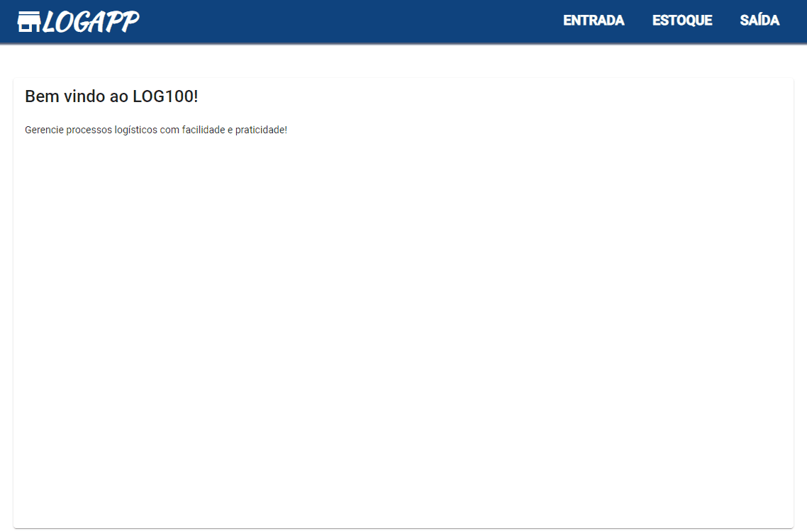

# Sistema Logístico - Front-end

      
Projeto que simula operações logísticas. Nele é possível cadastrar/receber produtos, gerar separações e conferir/expedir (pedidos). 

## Tecnologias Utilizadas

* Visual Studio Code
* Angular 12
* Typescript
* Angular Material

*Execução

`ng serve -o`

  